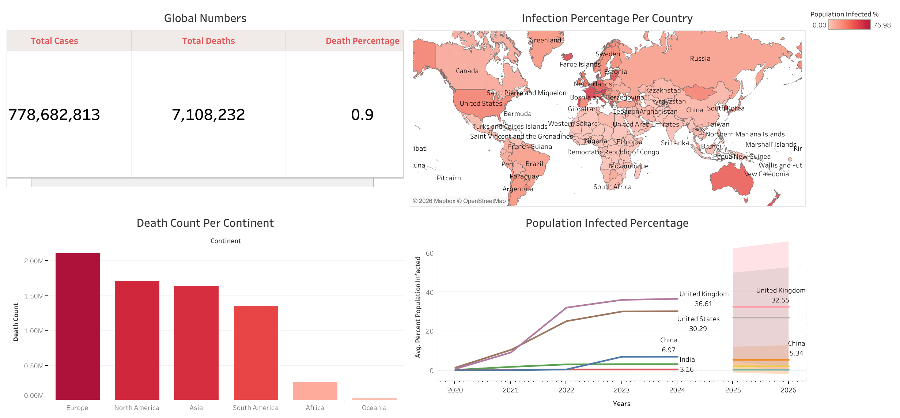

# Global Infection Statistics Dashboard

[**View the Interactive Dashboard on Tableau Public**](https://public.tableau.com/views/CovidDashboard_17645050732070/Dashboard1?:language=en-US&publish=yes&:sid=&:redirect=auth&:display_count=n&:origin=viz_share_link)

## Overview
This Tableau dashboard provides a comprehensive global overview of epidemiological data, tracking total cases, mortality metrics, and regional impacts from 2020 through 2026 (including future forecasting). 

## Dataset Tables Used
- `CovidDeaths`
- `CovidVaccinations`

## Visualizations Included
The dashboard is divided into four main analytical sections:

* **Global Numbers (KPIs):** Displays high-level global metrics, capturing over 778 million total cases, 7.1 million total deaths, and a global death percentage of 0.9%.
* **Infection Percentage Per Country (Choropleth Map):** A global geographical heatmap illustrating the percentage of the population infected in each country, with the intensity scale reaching up to 76.98%.
* **Death Count Per Continent (Bar Chart):** Ranks continents by total death toll. It highlights Europe with the highest absolute count (surpassing 2 million), followed sequentially by North America, Asia, and South America.
* **Population Infected Percentage (Time-Series & Forecasting):** A line chart tracking the average percent of the population infected over time (2020-2024) for select countries, including the UK, US, China, India, and Egypt. It features a predictive forecasting model (shaded regions) projecting trends into 2025 and 2026.

## Key Insights
1. **Global Mortality Context:** Despite the massive scale of total global cases (~778M), the overall aggregated death percentage stands at 0.9%.
2. **Geographical Burden:** The bar chart reveals a stark contrast in absolute death counts by continent, with Europe and North America bearing the highest numbers compared to Africa and Oceania.
3. **Comparative Country Trends:** Historical time-series data shows the United Kingdom and the United States experiencing significantly higher population infection percentages (peaking in the 30-36% range) compared to countries like China, India, and Egypt. 
4. **Future Projections:** The forecasting model suggests a gradual downward trend in the infection percentage across the highlighted nations moving into 2026.
